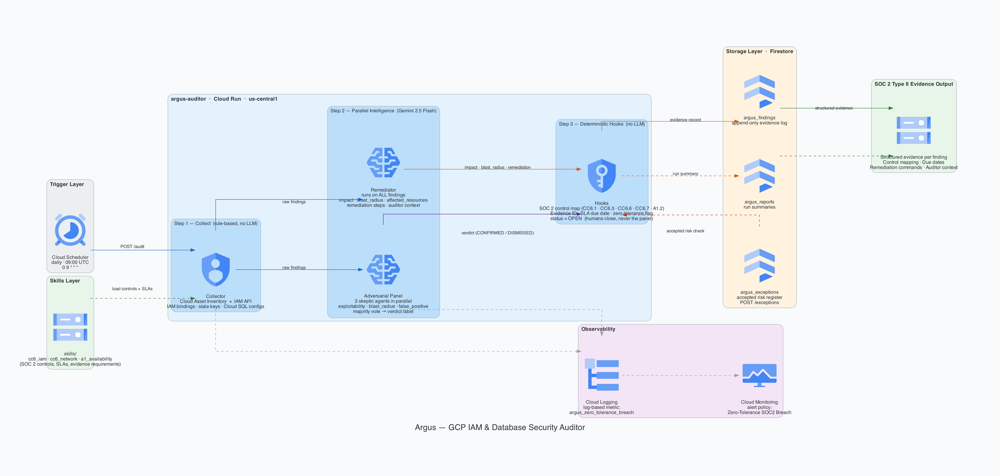

# Argus — GCP IAM & Database Security Auditor

Multi-agent security audit pipeline deployed on Google Cloud Run. Runs daily, collects IAM and database findings across a GCP project, runs each finding through an adversarial Gemini panel, generates impact + remediation, and stores structured SOC 2 Type II evidence in Firestore.



---

## What it does

Every day at 09:00 UTC, Cloud Scheduler triggers a full audit:

1. **Collect** — queries Cloud Asset Inventory and IAM API for real findings:
   - Service accounts with primitive roles (`roles/owner`, `roles/editor`)
   - Public bindings (`allUsers`, `allAuthenticatedUsers`)
   - Service account keys older than 90 days
   - Cloud SQL instances with public IP, SSL not required, open authorized networks, backups disabled

2. **Adversarial Panel** — 3 Gemini 2.5 Flash skeptic agents run in parallel on every finding, each with a distinct lens:
   - `exploitability` — is this actually exploitable in context?
   - `blast_radius` — if exploited, what's the real damage?
   - `false_positive` — is this expected config or a real issue?
   
   All three default to `refuted=true` if uncertain. Majority vote (2/3) determines verdict. Panel result is a **label** — it never suppresses a finding.

3. **Remediator** — runs on **all findings** regardless of panel verdict. Generates:
   - `impact` — what an attacker gains if unresolved
   - `blast_radius` — which systems and data are at risk
   - `affected_resources` — exact GCP resource paths
   - `remediation_steps` — step-by-step `gcloud` commands with actual resource names
   - `auditor_context` — why this matters for SOC 2

4. **Deterministic Hooks** — no LLM, pure functions:
   - SOC 2 control mapping (`CC6.1`, `CC6.3`, `CC6.6`, `CC6.7`, `A1.2`)
   - Evidence ID (stable per resource+type)
   - SLA due date (7 days for HIGH, 30 for MEDIUM, 90 for LOW)
   - Zero-tolerance flag per control
   - Status = `OPEN` — humans close findings, never the panel

5. **Store** — all findings written to Firestore, append-only. Every run creates new documents. Nothing is overwritten.

---

## SOC 2 Controls Covered

| Control | Name | Finding Types |
|---|---|---|
| CC6.1 | Logical Access Controls | `public_binding` |
| CC6.3 | Least Privilege | `primitive_role`, `stale_key` |
| CC6.6 | Network Restrictions | `public_ip`, `open_authorized_network` |
| CC6.7 | Encryption in Transit | `ssl_not_required` |
| A1.2  | Backup & Recovery | `backups_disabled` |

---

## Architecture

```
Cloud Scheduler (daily 09:00 UTC)
        │
        ▼
argus-auditor  ·  Cloud Run  ·  us-central1
  │
  ├─ Step 1: Collector (rule-based, no LLM)
  │     Cloud Asset Inventory + IAM API
  │
  ├─ Step 2: Parallel Intelligence (Gemini 2.5 Flash)
  │     ├─ Adversarial Panel  →  verdict label
  │     └─ Remediator         →  impact + blast_radius + remediation
  │
  └─ Step 3: Deterministic Hooks
        SOC 2 control map · SLA · Evidence ID · zero-tolerance flag
        │
        ▼
    Firestore (append-only)
    argus_findings · argus_reports · argus_exceptions
        │
        ▼
    Cloud Logging → log-based metric → Cloud Monitoring alert
    (fires on zero-tolerance breach)
```

---

## Deploy to your own GCP project

**Prerequisites:** `gcloud` CLI, `gh` CLI, a GCP project with billing enabled.

```bash
# 1. Clone
git clone https://github.com/TanishkaMarrott/argus-gcp
cd argus-gcp

# 2. Set your project
export GCP_PROJECT_ID=your-project-id
gcloud config set project $GCP_PROJECT_ID

# 3. Enable required APIs
gcloud services enable \
  run.googleapis.com \
  cloudasset.googleapis.com \
  cloudscheduler.googleapis.com \
  aiplatform.googleapis.com \
  firestore.googleapis.com \
  secretmanager.googleapis.com \
  cloudbuild.googleapis.com

# 4. Create Firestore database (if not exists)
gcloud firestore databases create --location=us-central1

# 5. Run infra setup (generates ARGUS_SECRET)
bash infra/setup.sh

# 6. Deploy to Cloud Run
gcloud run deploy argus-auditor \
  --source=. \
  --region=us-central1 \
  --set-env-vars="PROJECT_ID=${GCP_PROJECT_ID},REGION=us-central1,GEMINI_MODEL=gemini-2.5-flash,ARGUS_SECRET=<your-secret>" \
  --memory=512Mi --cpu=1 --timeout=1800

# 7. Create daily scheduler
bash infra/create_scheduler.sh <SERVICE_URL>
```

---

## API Endpoints

All endpoints require `X-Argus-Secret` header.

| Method | Path | Description |
|---|---|---|
| `POST` | `/audit` | Trigger a full audit run (called by Cloud Scheduler) |
| `GET` | `/findings` | Last 100 findings from Firestore |
| `GET` | `/findings/open` | All OPEN findings ordered by due date |
| `POST` | `/exceptions` | Register an accepted risk |
| `GET` | `/exceptions` | List all accepted risks |
| `GET` | `/health` | Health check |

### Register an accepted risk

```bash
curl -X POST https://<SERVICE_URL>/exceptions \
  -H "X-Argus-Secret: <secret>" \
  -H "Content-Type: application/json" \
  -d '{
    "evidence_id": "EVD-41D937",
    "finding_type": "primitive_role",
    "resource": "projects/my-project",
    "accepted_by": "you@example.com",
    "reason": "Default Compute SA — personal project, no sensitive data",
    "review_date": "2026-09-17"
  }'
```

---

## Skills

Skills are YAML files in `skills/` that define SOC 2 controls, SLAs, and evidence requirements. Add a new skill to extend coverage without touching code:

```yaml
skill: cc7_monitoring
control: CC7.2
control_name: "Monitoring for Anomalies"
finding_types:
  - audit_log_disabled
sla_days:
  HIGH: 1
  MEDIUM: 7
auditor_evidence_needed:
  - Screenshot of audit log configuration
  - Confirmation of log retention policy
zero_tolerance:
  - audit_log_disabled
review_frequency_days: 7
remediation_owner: platform-team
```

---

## Regenerate architecture diagram

```bash
pip install diagrams
brew install graphviz
python3 infra/diagram.py
```

---

## Tech stack

| Component | Technology |
|---|---|
| Compute | Cloud Run (us-central1) |
| Trigger | Cloud Scheduler |
| Intelligence | Vertex AI — Gemini 2.5 Flash |
| Data sources | Cloud Asset Inventory, IAM API |
| Storage | Firestore (Native mode) |
| Observability | Cloud Logging, Cloud Monitoring |
| Language | Python 3.12, FastAPI |
